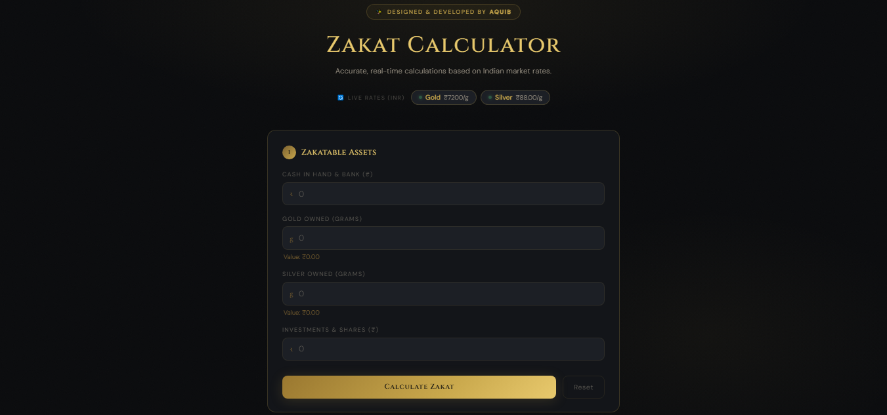
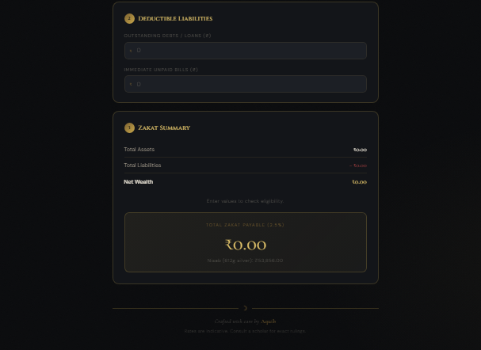

  

  

 

> **A sophisticated, user-friendly, and highly accurate web application designed to help individuals calculate their annual Zakat based on Islamic principles. The application features a premium dark aesthetic with gold accents, providing a seamless and distraction-free user experience.**

 

## 📸 Premium Interface

  <!-- 
   -->
  
  
  
<i>Clean, intuitive, and modern user interface</i>

## 📖 About The Project

Zakat is one of the Five Pillars of Islam, requiring Muslims to donate a portion of their wealth to those in need. However, calculating the exact amount can sometimes be confusing due to different asset types and liabilities. 

I developed this **Zakat Calculator** to solve this problem. It automates the complex mathematical logic and provides users with a clear, real-time summary of their total assets, deductible liabilities, and the final net wealth eligible for Zakat.

## ✨ Comprehensive Features

* 🪙 **Real-Time Calculation:** The math happens instantly as you type. No page reloads or submit buttons required.
* 📊 **Multi-Asset Support:** Dedicated input fields for various wealth categories including:
  * Cash in Hand & Bank Accounts
  * Gold Owned (Value in your local currency)
  * Silver Owned
  * Business Investments & Shares
* ➖ **Liability Deductions:** A dedicated section to subtract outstanding debts, loans, and immediate unpaid bills to ensure you only pay Zakat on your *net* wealth.
* 📱 **Fully Responsive:** Beautifully optimized for all screen sizes, from large desktop monitors to small smartphones.
* 🎨 **Premium UI/UX:** Designed with a sophisticated dark mode (Black & Gold theme) that reduces eye strain and provides a luxurious feel.

## ⚙️ How It Works (User Flow)

The application is divided into three simple, logical steps:

1. **Step 1: Zakatable Assets** 
   Users enter the current monetary value of all their assets (Cash, Gold, Silver, Investments).
2. **Step 2: Deductible Liabilities**
   Users input any money they owe to others (Debts, Loans, Pending Bills).
3. **Step 3: Zakat Summary**
   The system automatically calculates the formula: 
   `(Total Assets - Total Liabilities) = Net Wealth`. 
   If eligible, it calculates **2.5%** of the Net Wealth as the final Zakat amount.

## 💻 Technology Stack

This project was built using modern, fast, and reliable web technologies:

  
  
  
  

## 🚀 Future Roadmap

- [ ] Add live API integration for real-time Gold and Silver rates.
- [ ] Add multiple currency support (INR, USD, AED, etc.).
- [ ] Implement an option to download the calculation summary as a PDF receipt.

## 👨‍💻 About the Developer

Developed with ❤️ and passion by **Mohd Aquib**, a Data Science student and Web Developer from Aligarh.

* 📧 **Email:** [mohdaquib195@gmail.com](mailto:mohdaquib195@gmail.com)
* 🌐 **GitHub:** [@Aquib6544](https://github.com/Aquib6544)
* 💼 **Portfolio / Live Site:** [Zakat Calculator](https://zakatcalculator-aquib.netlify.app/)

  

